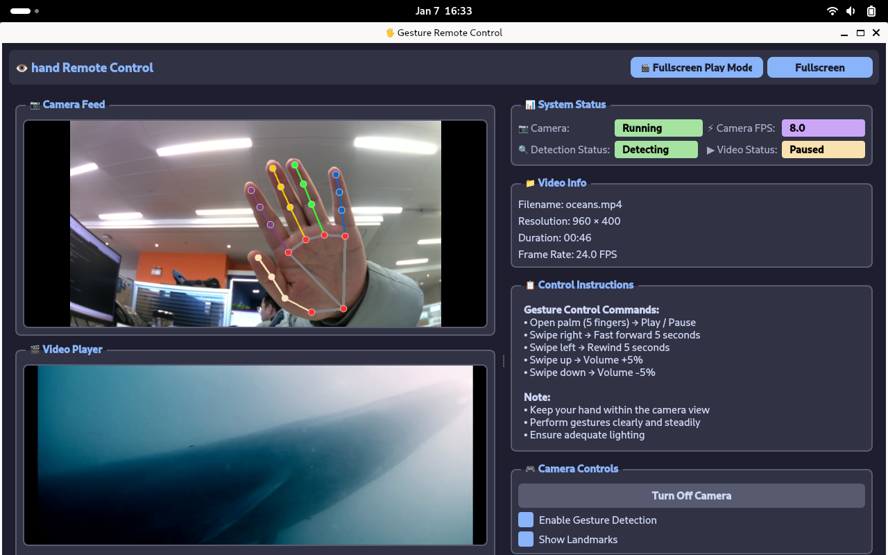
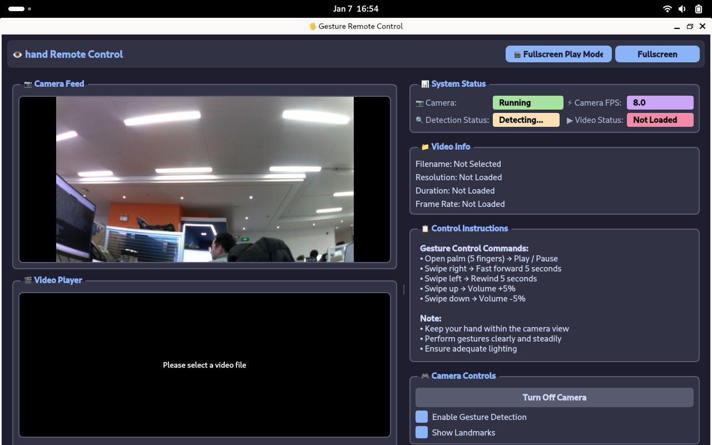

# 手势遥控器

[English](README_en.md) | 中文

本项目是一个基于 [Quectel Pi H1 单板电脑](https://developer.quectel.com/doc/sbc/)实现的手势识别远程视频控制示例。
系统通过摄像头采集手部图像，结合 AI 手势识别算法，实现隔空控制视频播放、进度与音量的自然交互体验。



## 功能特性

- 实时手部检测与跟踪
- 支持多种直觉化控制手势
- 视频播放远程控制
   - 播放 / 暂停
   - 快进 / 快退
   - 音量调节
- 手部状态可视化（Hand detected / No hand detected）
- 支持单手自然操作，低学习成本
- 本地处理，低延迟、无需云端依赖

**支持的手势映射**

> 请确保摄像头正对用户操作区域，并具备稳定光照条件。

|手势动作|控制功能|
|----------|---------|
|张开手掌（5 指）|播放 / 暂停|
|手指向右滑动|快进 5 秒|
|手指向左滑动|快退 5 秒|
|手指向上滑动|音量 +5%|
|手指向下滑动|音量 -5%|

## 硬件要求

- Quectel Pi H1 单板电脑  
- USB 摄像头
- 显示设备（DSI 触控屏）
- 音频输出设备（扬声器或耳机）  

## 软件环境搭建

> 确认系统是否存在多个python版本，避免安装后提示包导入失败问题。

- 操作系统：Debian 13（Quectel Pi H1 默认系统）  
- 视频播放：ffmpeg 
- Python：Python 3  
- 依赖组件：
   - Python 3.9-3.12
   - OpenCV-Python == 4.8.1.78
   - MediaPipe == 0.10.9
   - NumPy == 1.24.3
   - PySide6 == 6.5.3
   - protobuf == 3.20.3

```shell
# 更新镜像源及安装ffmpeg
sudo apt update && sudo apt install -y ffmpeg
# 更新pip
pip install --upgrade pip
# 安装python包
pip install -r requirements.txt
```

## 项目结构

```
gesture-remote-control/
├── docs                        # 项目文档
│   ├── assets                  # 静态资源文件
│   └── oceans.mp4              # 示例播放视频
├── src/                        # 源代码目录
|   ├── main.py                 # 主程序入口
│   ├── gesture_recognizer.py   # 眼部检测核心逻辑
│   ├── video_capture.py        # 视频采集线程
│   ├── video_player.py         # 视频播放器线程
│   ├── fullscreen_player_mode.py  # 全屏播放模式界面
│   ├── log.py                  # 日志记录模块
├── log_files/                  # 日志文件
├── README.md                   # 项目中文说明文档
├── README_en.md                # 项目英文说明文档
└── requirements.txt            # 依赖包列表
```

## 运行程序

```shell
# 进入源码目录
cd src
# 运行程序
python3 main.py
```


## 报告问题
欢迎提交Issue和Pull Request来改进此项目。
